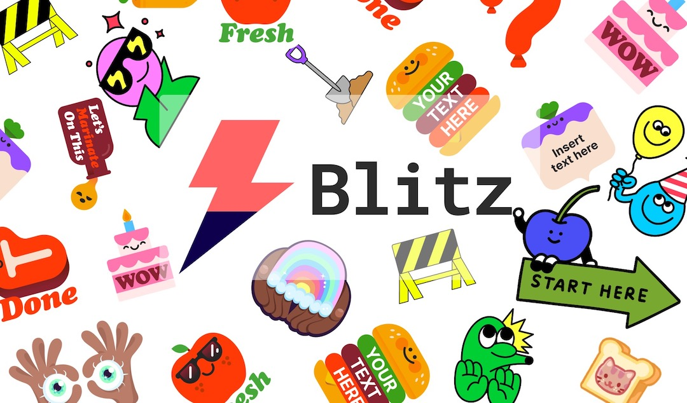
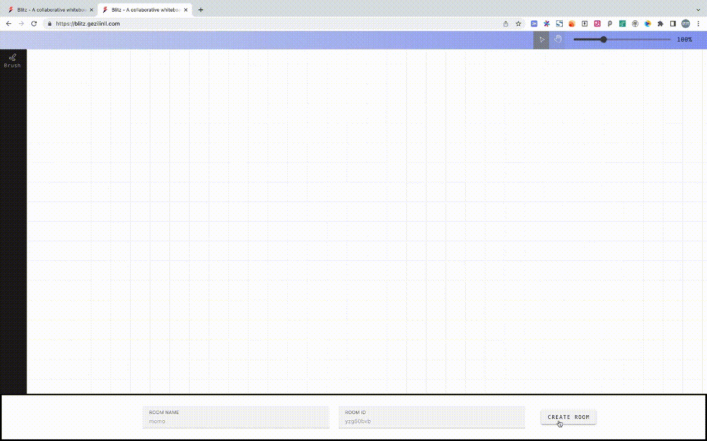

# Blitz
Blitz is a collaborative whiteboard application capable of voice and video chatting. It covers the complete process from the front-end editor to the back-end service. It supports brushes, text, pictures, paths, videos and other elements as well as rich special effects capabilities. The scene can meet your design needs, and it can provide complete reference and full communication from the technical point of view.

# Preview



Online Website: https://blitz.gezilinll.com

# Local development

Run the following command in the root directory:
```javascript
pnpm install
pnpm run dev
```
and you can visit the editor on `http://localhost:5173` , the port maybe different, the address will output on the console.

# Server

### Collaboration

Run the following command in the `server` directory(on the server):

```javascript
pnpm install
npx tsc
node dist/whiteboard.js
```

### Media Stream

Coming soon.


# License
GNU General Public License, version 3 or later.